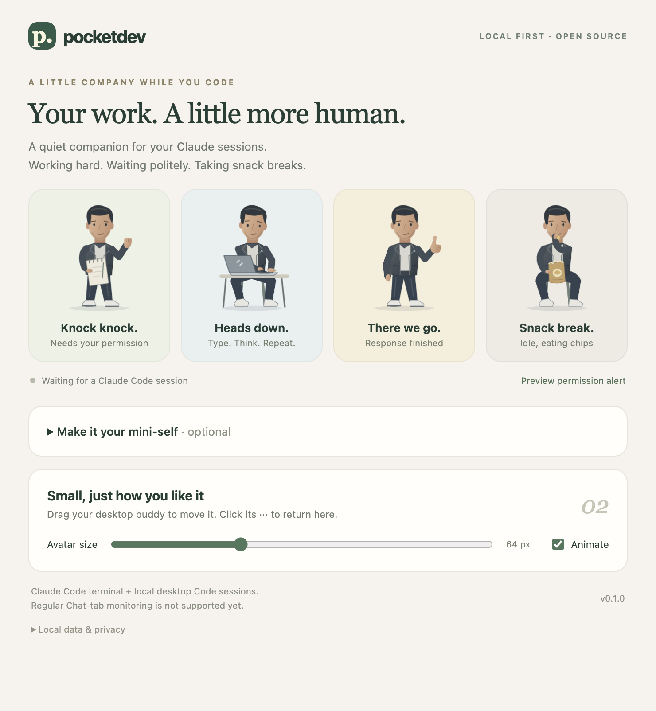

# PocketDev

A small animated developer who keeps you company while Claude Code works.



PocketDev sits in a draggable **48–120 px** desktop window. It types while Claude works, knocks when permission is needed, jumps with a thumbs-up when a response finishes, and eats chips during a break. Use the included character or create a mini version of yourself from one photo.

**Release status: beta, not production-approved yet.** The current source includes two supplied audio recordings whose redistribution rights have not been verified. Public distribution is blocked until those rights are documented or the recordings are replaced. Builds are unsigned; Windows/Linux need native validation. See the [release review](docs/release-review.md).

## Install

You need:

- Local **Claude Code**, in the terminal or a local desktop Code session that runs hooks on your computer.
- **Node.js 22+** available on Claude's `PATH` (`node --version`).
- A graphical desktop and internet access for the first download.
- A **published release matching the plugin version**, including your platform's archive and `.sha256` file. Draft releases cannot be downloaded by the plugin.

Inside Claude Code:

```text
/plugin marketplace add Sagar2011/pocketdev
/plugin install pocketdev@pocketdev-local
```

Choose **Install for you**, then start a **new Claude Code session**. PocketDev downloads the matching desktop app, checks its SHA-256 checksum, and launches the avatar. The first download may take a few minutes; later starts reuse the cached app. You do not need `npm start` or a separate manual app launch for a published plugin installation.

The plugin needs a companion process to draw a desktop window. It starts that process for you; it does not install a login item, service, or scheduled task. One avatar runs per data folder. It remains available after Claude closes until you quit it.

| Platform            | Release asset                          | Validation boundary                 |
| ------------------- | -------------------------------------- | ----------------------------------- |
| macOS Apple Silicon | `PocketDev-VERSION-mac-arm64.zip`      | Local desktop tests and packaging   |
| macOS Intel         | `PocketDev-VERSION-mac-x64.zip`        | Separate native build/test required |
| Windows x64         | `PocketDev-VERSION-win-x64.zip`        | Native validation required          |
| Linux x64           | `PocketDev-VERSION-linux-x64.AppImage` | Native validation required          |

Only platforms with published assets are available. Regular Claude **Chat** tabs, SSH/cloud sessions, and remote containers are not supported. Linux needs desktop libraries required by Electron; AppImage extraction mode avoids requiring FUSE. Positioning and always-on-top behavior can vary under Wayland.

## Everyday use

Drag the character to move it. Click **···** for settings; right-click for the menu.

| State                        | Animation and sound                                                                      |
| ---------------------------- | ---------------------------------------------------------------------------------------- |
| Working / **Heads down**     | Typing and occasional head scratches; keyboard recording loops at 18% playback volume    |
| Permission / **Knock knock** | Notepad knock; two knocks every six seconds, increasing for three rounds and then capped |
| Waiting for an answer        | Notepad gesture; silent                                                                  |
| Done / **There we go**       | Thumbs-up jump; party-popper recording plays once at 45% playback volume                 |
| Idle / **Snack break**       | Eating chips; silent                                                                     |
| Error                        | Attention indicator; silent                                                              |

**Done means Claude finished responding, not that the task or its tests succeeded.** It returns to idle after six seconds. Permissions take precedence across sessions; otherwise the newest activity wins. Events expire after 30 minutes without updates, so long quiet operations can appear idle.

Settings provides independent **Permission knocks**, **Typing sound**, and **Party popper** toggles. **Animate** controls movement; the system's Reduce Motion preference is also respected. Audio stops when the state changes or its toggle is disabled.

Click **×** to dismiss current reminders locally. This never approves or denies anything in Claude. Some approvals and interruptions have no immediate corresponding hook: after approving a long-running tool or pressing Escape, dismiss the reminder if it continues. A new request can alert again. Dismissal resets when PocketDev exits.

### Test it

1. Open settings and click the four pose cards. Check that animation and the corresponding sound play; idle should be silent.
2. Click **Preview permission alert**. It runs for 30 seconds: listen for double knocks at roughly 0, 6, 12, 18, and 24 seconds. Click another pose or **×** to stop it.
3. In a new local Claude session, ask a short question. The avatar should move from Working to Done to Idle.
4. For a real permission test, use a disposable project. In Claude's `/permissions`, add an **Ask** rule for `Write`, then ask Claude to create a small test file. Leave the prompt unanswered to hear repeating knocks; approve or deny in Claude. Remove the temporary rule afterward. Do not use bypass mode for this test.

Live permissions override previews, and new live activity ends a preview. Test previews when Claude is otherwise idle.

## Change your avatar

### From one photo

1. Open **··· → Make it your mini-self → Choose a photo**.
2. Select a clear PNG, JPEG, or WebP under 10 MB.
3. Enter your OpenAI API key, then select **Create my mini-self**.
4. PocketDev makes four sequential image-edit requests and activates the completed set.

This optional feature uses `gpt-image-1.5` at medium quality. **It makes four paid API requests**, separately billed from Claude or ChatGPT subscriptions. Check [API pricing](https://developers.openai.com/api/docs/pricing) first. Your original photo is sent with each request; the first generated pose is used as a style reference for the rest.

**Stop** or closing settings cancels generation. Completed files stay in the local avatar folder; the existing avatar remains active on cancellation or failure. An in-flight provider request may still be billed. There are no automatic retries; trying again starts all four requests again.

Custom packs contain four still poses with gentle motion, not full animated sprite sheets. The default buddy has four textured frame sequences with moving hands, head scratches, jumps, and chips. Likeness and consistency of generated images can vary.

### Import artwork without an API key

Choose **Import poses** and select matching, square, transparent PNGs, each under 10 MB:

```text
waiting.png   required — notepad
working.png   required — laptop
done.png      required — thumbs-up
idle.png      optional — snack break; otherwise waiting.png is used
```

**Use default buddy** switches back without deleting saved packs. The default character needs no photo or API key.

## Pause, update, or uninstall

To stop now, right-click → **Quit PocketDev**. A new Claude session will start it again. To keep it off, first uncheck **Start automatically with Claude**. Run `/pocketdev:help` to resume startup while the avatar is closed.

Terminal commands for a user-scoped installation:

```sh
# Pause or resume plugin hooks
claude plugin disable pocketdev@pocketdev-local
claude plugin enable pocketdev@pocketdev-local

# Refresh the catalog and install an update
claude plugin marketplace update pocketdev-local
claude plugin update pocketdev@pocketdev-local

# Remove the plugin
claude plugin uninstall pocketdev@pocketdev-local
```

Start a new Claude session after changes. For an update, **quit the old avatar first** so the matching new companion can start. A separately paused autostart setting remains paused until you re-enable it. For project/local installations, use the appropriate `--scope project` or `--scope local` and run from that project.

Disabling or uninstalling hooks does not terminate a running companion; quit it from its menu. After quitting, you can remove `~/.pocketdev/runtime/` to reclaim downloaded apps. Preferences and custom avatars are kept separately. Delete the entire `~/.pocketdev/` folder only if you also want to erase those files.

## Troubleshooting

Run `/pocketdev:help` first. It reads local startup diagnostics.

| Symptom                                   | What to check                                                                                                        |
| ----------------------------------------- | -------------------------------------------------------------------------------------------------------------------- |
| No avatar after installation              | Start a new session; check `node --version`, desktop availability, and OS security prompts                           |
| Download returns 404                      | The exact version's platform archive and checksum must be publicly published, not draft                              |
| Checksum mismatch                         | Do not run that download; retry a new session and report the version/platform if it persists                         |
| Installer timed out                       | Retry after ten minutes, when its crash lock expires                                                                 |
| Terminal works, desktop Code does not     | The desktop app may not inherit your Node version manager's PATH; make Node available there and fully restart Claude |
| Old appearance or behavior after updating | Quit PocketDev, update the marketplace/plugin, then start a new session                                              |
| Permission keeps knocking                 | Approve/deny in Claude; use **×** if a corresponding completion/interruption hook has not arrived                    |
| Silent audio                              | Check the three sound toggles and system/app volume; use the preview cards                                           |
| Avatar stops showing a long-running task  | Activity expires after 30 minutes without a hook; it is not a continuous process monitor                             |

Diagnostics are in `~/.pocketdev/runtime-status.json`. `launched` means the OS accepted the process launch, not that a visible window was verified. Unsigned builds may need OS approval; do not disable Gatekeeper, antivirus, or Electron's sandbox. SHA-256 verifies transfer integrity, not an independent publisher signature.

## Privacy and local data

PocketDev has no telemetry, hosted backend, or account system.

- `~/.pocketdev/sessions/`: status, timestamps, sanitized tool names, and hashed session/agent/request identifiers. No prompts, commands, working directories, or transcripts are saved. Old files are pruned after a day while the companion runs.
- `~/.pocketdev/avatars/`: generated/imported PNG packs.
- `~/.pocketdev/preferences.json`: appearance and sound preferences.
- `~/.pocketdev/runtime/`: versioned companion downloads. Old versions remain available for offline reuse or rollback.
- The API key and source photo are not intentionally written to disk. Closing settings releases the selected photo and cancels generation.
- Network access: GitHub for companion downloads; OpenAI only when you explicitly generate a custom avatar. Provider retention policies apply to photos sent for generation.

On Windows, the default folder is `%USERPROFILE%\.pocketdev`. `POCKETDEV_HOME` overrides it; use the same **absolute path** for Claude and the companion. The avatar is a convenience indicator, not a trusted permission interface. See [security reporting](SECURITY.md).

## Develop locally

Use Node 22+ (the Volta pin and CI use Node 22). From this repository:

```sh
npm ci
npm test
npm start
```

In a second terminal, load the development plugin without downloading a released app:

```sh
POCKETDEV_AUTOSTART=0 claude --plugin-dir ./plugin
```

PowerShell: set `$env:POCKETDEV_AUTOSTART = '0'`, then run `claude --plugin-dir ./plugin`. Remove the environment variable to restore normal startup. Exit that Claude session and omit `--plugin-dir` to stop testing the local plugin.

```sh
npm run test:desktop  # Requires a graphical desktop; isolated temporary data
npm run pack          # Unpacked local app
npm run dist          # Archive for the current platform in dist/
```

Tests use a mocked image provider and never make paid API requests. Set `POCKETDEV_SCREENSHOTS` to save desktop-test captures. `POCKETDEV_TEST_NODE` optionally overrides the Node executable used by the desktop test; otherwise it uses npm's Node executable.

The project uses Electron, vanilla HTML/CSS/JavaScript, and Node's standard library. No frontend framework, database, server, or agent coordinator. See [contribution and release instructions](CONTRIBUTING.md) and the [release review](docs/release-review.md).

## License and attribution

Code and default artwork are distributed under [MIT](LICENSE); see [artwork provenance](app/assets/buddy/README.md). The supplied audio recordings have **unverified, separate redistribution terms** and are not covered by that MIT grant: see [audio provenance](app/assets/sounds/README.md). User photos and generated/imported packs remain separate from the repository license.

Independent project by [Sagar](https://github.com/Sagar2011), not affiliated with Anthropic or OpenAI. References: [Claude hooks](https://code.claude.com/docs/en/hooks), [Claude plugins](https://code.claude.com/docs/en/plugins), [marketplaces](https://code.claude.com/docs/en/plugin-marketplaces).
