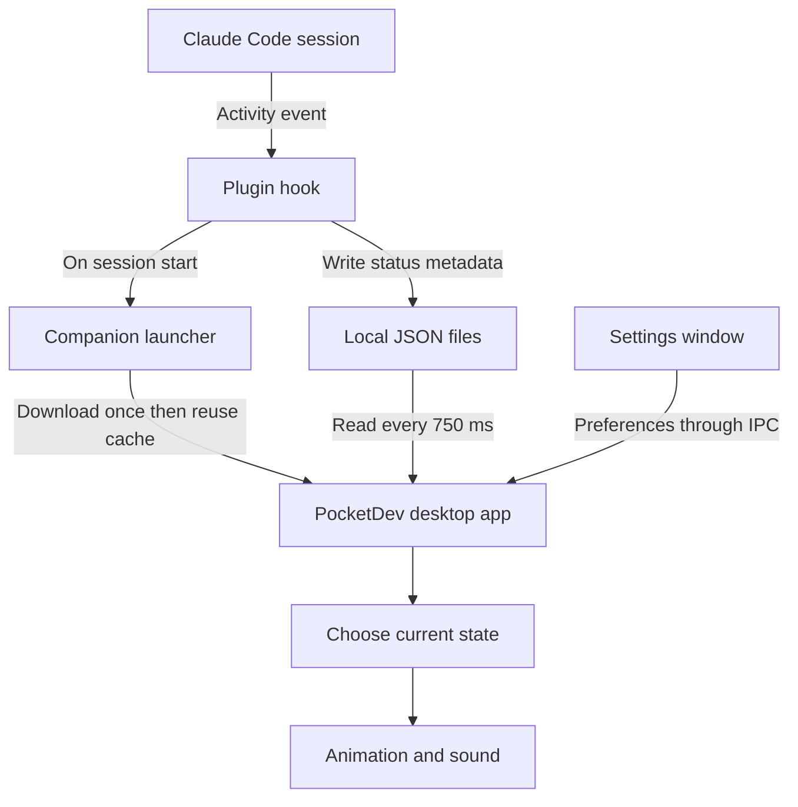

# PocketDev architecture and debugging guide

This guide explains PocketDev from basic concepts to the code that implements them. It covers the released 2.0.0 design, local development, troubleshooting, testing, and release ownership. Read it alongside the source when changing behavior; future releases may change details.

PocketDev is an **event-driven desktop app**. Claude does the thinking. PocketDev receives activity notifications and chooses an animation and sound. Normal activity tracking requires no AI request, server, or database.

## Opening the settings window

The character itself is a **drag area**, so clicking its body does not open settings.

1. Find the small **··· button at the bottom-right** of the avatar’s square area.
2. Click **···** to open the customization window.

The button is always visible in the updated source. Older releases hide it until hover; installing a new release is required to change an already-installed companion.

The **×** button dismisses a reminder; it does not open settings or approve Claude permissions. The context menu offers **Customize PocketDev…**, too. If right-clicking the draggable body does not open it on your OS, try right-clicking the **···** button, which is explicitly outside the drag region.

The implementation is in [avatar.css](../app/avatar.css), [avatar.html](../app/avatar.html), and [avatar.js](../app/avatar.js): `#buddy` uses `-webkit-app-region: drag`; `#customize` uses `no-drag` and its click handler calls `window.pocketdev.settings()`.

## The complete architecture



There are three pieces:

| Piece       | Everyday meaning                          | Implementation                    |
| ----------- | ----------------------------------------- | --------------------------------- |
| Marketplace | Catalog telling Claude where PocketDev is | `.claude-plugin/marketplace.json` |
| Plugin      | Listener for Claude activity              | `plugin/`                         |
| Companion   | Floating desktop avatar and settings      | Electron application in `app/`    |

A plugin hook cannot draw a floating desktop window itself. The companion provides that window. Initially it needed a separate manual launch; the bootstrap now downloads and starts it automatically so users experience one plugin installation.

## How installation reaches your code

Claude reads the marketplace entry and installs the `plugin/` directory.

- [Marketplace manifest](../.claude-plugin/marketplace.json): where users obtain the plugin.
- [Plugin manifest](../plugin/.claude-plugin/plugin.json): its name, version, description, and author.
- [Hooks configuration](../plugin/hooks/hooks.json): which program Claude runs for each event.

When a new session begins, Claude runs [hook.cjs](../plugin/scripts/hook.cjs). It sends JSON through **standard input**, or `stdin`: a channel for passing input into a program.

For example:

```json
{
  "hook_event_name": "SessionStart",
  "session_id": "example-session"
}
```

The hook reads the JSON, writes a local activity record, asks the launcher to start PocketDev for `SessionStart`, and exits quietly. It is a short-lived program, not the long-running desktop app.

**Why quiet?** Hook output can affect Claude's behavior. PocketDev should not inject instructions or permission decisions.

**Why fail-open?** If the companion fails, Claude should continue working. The hook bounds input size, has a short input timeout, and ignores its own failures rather than blocking the user's coding session.

## Automatic startup and downloads

[runtime.cjs](../plugin/scripts/runtime.cjs) is the launcher, also called the **bootstrap**.

```text
Is automatic startup enabled?
        ↓
Is this a supported local desktop?
        ↓
Is this exact companion version already downloaded?
        ↓
Yes: launch it
No: download → verify → extract → launch
```

For version `2.0.0` on an Apple Silicon Mac, it selects:

```text
PocketDev-2.0.0-mac-arm64.zip
PocketDev-2.0.0-mac-arm64.zip.sha256
```

A **checksum** is a fingerprint of the downloaded bytes. If the calculated fingerprint differs from the published one, installation stops. It catches corruption or mismatched files; it is not a substitute for publisher signing.

The app is cached under `~/.pocketdev/runtime/`. A **cache** stores a result for reuse, avoiding another download on every session.

Two locks solve different problems:

| Mechanism            | Purpose                                                               |
| -------------------- | --------------------------------------------------------------------- |
| Installation lock    | Prevent simultaneous downloads/extractions by multiple session starts |
| Single-instance lock | Prevent multiple running companion instances for the same data folder |

The hook starts the installer as a **detached process**, meaning Claude does not wait for the download to finish. The installer stages files in a temporary directory and moves a complete installation into place. Later starts use the exact cached version.

Startup does not install a system service or login item. The app remains running until the user quits it. A new Claude session can start it again unless automatic startup is paused.

## Translating events into state

[state.cjs](../plugin/scripts/state.cjs) contains the behavior logic. A **state** is a named condition such as `idle`, `working`, `waiting`, `permission`, `done`, or `error`.

| Claude event         | Interpretation                            |
| -------------------- | ----------------------------------------- |
| `SessionStart`       | Idle                                      |
| `UserPromptSubmit`   | Working                                   |
| `PreToolUse`         | Working, or Waiting for `AskUserQuestion` |
| `PermissionRequest`  | Needs permission                          |
| `PostToolUse`        | Working                                   |
| `PostToolUseFailure` | Error                                     |
| `Stop`               | Response finished                         |
| `SessionEnd`         | Session ended                             |

The main functions divide responsibilities:

| Function           | Responsibility                                    |
| ------------------ | ------------------------------------------------- |
| `fromHook()`       | Translate a Claude event                          |
| `writeEvent()`     | Save its metadata                                 |
| `readEvents()`     | Read valid recent records                         |
| `resolvedEvents()` | Resolve session boundaries and completed requests |
| `visibleEvents()`  | Apply local dismissals                            |
| `displayState()`   | Choose the state the user sees                    |

Records live in `~/.pocketdev/sessions/`. Files act as a small local communication mechanism, avoiding a server, socket protocol, or database.

### Why there is more than one status file

Suppose session A is waiting for permission while session B finishes reading a file. B's completion must not clear A's reminder. One global `status.json` would lose that distinction.

PocketDev tracks session, agent, and request identifiers separately. Their saved values are hashed. Prompt and command contents are not saved.

The display rules include:

- Permission takes priority across sessions.
- Otherwise, the latest relevant activity wins.
- Done becomes idle after six seconds.
- Activity expires after 30 minutes without an update.
- Old files are pruned after a day while the companion runs.

These are product rules implemented locally. They are not a continuous measurement of what Claude is doing. A long operation with no new hook can appear idle after expiry.

Some approvals and interruptions have no immediate corresponding event. A reminder may continue after approval until the matching tool finishes. Dismiss it with **×** when needed; PocketDev never approves or denies a request itself.

## Electron and the desktop window

[main.cjs](../app/main.cjs) starts the Electron app. Electron combines a browser engine for drawing UI with a privileged main process for desktop operations.

| Part              | Responsibility                                                   |
| ----------------- | ---------------------------------------------------------------- |
| Main process      | Creates windows, reads files, handles preferences and generation |
| Avatar renderer   | Draws the floating character                                     |
| Settings renderer | Displays customization controls                                  |
| Preload bridge    | Exposes specific operations to the UI                            |

The main process checks local activity every **750 milliseconds**. This is **polling**: repeatedly checking for changes. It calculates the visible state and sends updates to the windows when that status changes.

Polling explains the fraction-of-a-second delay between a Claude event and the avatar's response.

The avatar is a transparent, frameless, always-on-top window. Its small dimensions and artwork make it look like a character sitting on the desktop. The body is draggable; buttons use a separate no-drag region.

## IPC and privilege boundaries

**IPC** means **inter-process communication**. It lets the UI request an operation from the main process.

[preload.cjs](../app/preload.cjs) exposes the bridge. For example, changing size follows this route:

```text
User moves the size slider
        ↓
settings.js calls window.pocketdev.preferences(...)
        ↓
preload sends an IPC request
        ↓
main.cjs validates the sender and value
        ↓
Preferences are saved and the avatar is resized
        ↓
Updated appearance is sent to the UI
```

The renderer gets specific methods such as `preferences()`, `preview()`, and `generate()`. It does not get unrestricted filesystem access.

The main process checks which window and frame sent each request. Tests verify that the avatar renderer cannot invoke settings-only mutations. Sandboxing, context isolation, blocked navigation, and the Content Security Policy provide additional boundaries.

A disabled frontend button is not an authorization check. Important rules must also be enforced in the main process. This is why reset rejects requests during generation even though its button is already disabled in the UI.

## Animation and artwork

| File                                             | Responsibility                              |
| ------------------------------------------------ | ------------------------------------------- |
| [avatar.js](../app/avatar.js)                    | Receives state and appearance updates       |
| [mascot.js](../app/mascot.js)                    | Builds character markup and selects artwork |
| [mascot.css](../app/mascot.css)                  | Controls frame timing and movement          |
| [Default artwork](../app/assets/buddy/README.md) | Documents the bundled sprite sheets         |

The default character is pre-rendered artwork, not a live 3D model. Each state has a sprite sheet containing four frames, like a small flipbook:

```text
Frame 1 → Frame 2 → Frame 3 → Frame 4
```

SVG view boxes crop and align the frames. CSS switches frames over time and adds transforms such as the jump.

- Texture and shading come from the images.
- Typing and head-scratch poses come from frame changes.
- Jumping and swaying come from CSS transforms.
- Reduced-motion preferences disable animation.

Custom photo-generated avatars use still poses with simpler movement. They do not contain the default character's frame sequences.

Correct state logic cannot fix a badly cropped sprite. First decide whether a visual problem belongs to state selection, asset loading, frame alignment, or CSS motion.

## Sound and cancellation

[knock.js](../app/knock.js) manages all activity sounds; its filename dates from the original knocking feature.

| State                | Implementation                                              |
| -------------------- | ----------------------------------------------------------- |
| Working              | Keyboard MP3 loops at `0.18` volume                         |
| Done                 | Party-popper MP3 plays once at `0.45` volume                |
| Permission           | Web Audio generates two impacts, repeated every six seconds |
| Idle, waiting, error | Silent                                                      |

When the state changes, the old sound stops before the next begins. Muting a state's preference stops it too. This condition prevents repeated updates from restarting the same sound:

```js
if (next === current) return;
```

The `epoch` variable is a cancellation counter. An asynchronous knock operation remembers its value. If the operation resumes after the state has changed, it sees a different value and does nothing.

Without that check, this race could occur:

```text
Begin starting permission audio
User dismisses the reminder
Audio startup finishes late
Old reminder unexpectedly plays
```

A **race condition** is behavior that depends on the timing of overlapping operations. Even a small app needs to consider races around timers, network requests, and file saves.

The recordings have separate provenance and redistribution considerations documented in [audio notes](../app/assets/sounds/README.md).

## One-photo customization

[generate.cjs](../app/generate.cjs) handles image validation, requests, and saving:

```text
Choose photo
    ↓
Validate type and size
    ↓
Generate waiting pose
    ↓
Generate working pose
    ↓
Generate done pose
    ↓
Generate idle pose
    ↓
Activate the completed pack
```

Requests run sequentially. Each uses the original photo; later requests also use the first generated pose as a style reference. The API key is used by the main process rather than by a renderer making direct provider calls.

This is optional, paid API usage. The default avatar and importing your own poses need no API key. No automatic paid retries occur.

An `AbortController` cancels active work. Cancellation must be checked at several points because asynchronous work can finish after the user clicks Stop.

We found and fixed a case where cancelling during the final file save could still activate the generated pack. Checks now occur around saves and immediately before activation. Completed files remain available locally even when the operation is cancelled; an in-flight provider request may still be billed.

Images are saved to a temporary file and then renamed. This helps prevent readers from seeing a partially written PNG. Preferences use a similar write-then-rename approach.

## The three copies of PocketDev

| Copy                | Location                | Changes when                    |
| ------------------- | ----------------------- | ------------------------------- |
| Source              | Your repository         | You edit files                  |
| Local build         | `dist/`                 | You run a build                 |
| Installed companion | `~/.pocketdev/runtime/` | A matching release is installed |

**Editing source does not change the installed companion.** If an edit to `knock.js` seems ineffective, first establish which copy is running.

The launcher reuses cached versions. Shipping different code under the same version is not a reliable update mechanism. Quit an old running companion before testing a newer version.

On Windows, the default data folder is `%USERPROFILE%\.pocketdev`. `POCKETDEV_HOME` overrides the location. Use a consistent absolute path for Claude and PocketDev.

## A safe local debugging session

Quit the released avatar first to avoid confusing two windows or overlapping sounds. From the repository root, in terminal one:

```sh
export POCKETDEV_HOME="$HOME/.pocketdev-debug"
export POCKETDEV_AUTOSTART=0
npm start
```

In terminal two, also from the repository root:

```sh
export POCKETDEV_HOME="$HOME/.pocketdev-debug"
export POCKETDEV_AUTOSTART=0
claude --plugin-dir ./plugin
```

Both processes must use the same data folder. The separate debug folder keeps development preferences and events away from normal installed data.

`POCKETDEV_AUTOSTART=0` stops the development Claude session from downloading and starting a released companion. You are already running the source app with `npm start`.

After testing, exit the development Claude session and stop the source app. In those terminals, remove the overrides before using normal installation behavior:

```sh
unset POCKETDEV_HOME POCKETDEV_AUTOSTART
```

These commands are for macOS/Linux shells. In PowerShell, set environment variables with `$env:POCKETDEV_HOME = ...` and `$env:POCKETDEV_AUTOSTART = '0'`.

## Testing the bridge without Claude

Keep the debug app running. In another terminal with the same debug environment and repository directory, send a synthetic event through the real hook:

```sh
printf '%s' '{"session_id":"debug-session","hook_event_name":"UserPromptSubmit"}' |
  node plugin/scripts/hook.cjs
```

The avatar should start working. Next, request permission:

```sh
printf '%s' '{"session_id":"debug-session","hook_event_name":"PermissionRequest","tool_name":"Write"}' |
  node plugin/scripts/hook.cjs
```

It should knock. Finally, finish the response:

```sh
printf '%s' '{"session_id":"debug-session","hook_event_name":"Stop"}' |
  node plugin/scripts/hook.cjs
```

It should celebrate and then become idle. These commands do not ask Claude to edit anything; they inject controlled activity metadata into your debug folder.

This replaces the external system with controlled input while exercising your real bridge code. If it works but actual Claude activity does not, investigate plugin loading, hook execution, or Claude's Node environment.

## Finding the first broken boundary

| Symptom                               | First check                                                                |
| ------------------------------------- | -------------------------------------------------------------------------- |
| Avatar never launches                 | `/pocketdev:help`, then `runtime-status.json`                              |
| Download fails                        | Exact release version, platform archive, checksum                          |
| Avatar ignores Claude                 | Are session files changing? Are both processes using the same data folder? |
| Records change but state is wrong     | `resolvedEvents()` and `displayState()`                                    |
| State is correct but artwork is wrong | `avatar.js`, asset paths, CSS, reduced-motion preference                   |
| Animation works but sound does not    | Sound preferences, MP3 loading, `knock.js`                                 |
| Source changes have no effect         | Source process versus cached release                                       |
| Photo generation fails                | Main-process error, provider response, cancellation, partial pack          |
| Clicking the avatar body does nothing | Body is draggable; click the bottom-right **···**                          |

From the repository, read startup diagnostics:

```sh
node plugin/scripts/runtime.cjs status
```

Inspect the state computed from the currently configured data folder:

```sh
node -e 'const s = require("./plugin/scripts/state.cjs"); console.log(s.displayState(s.readEvents(s.home())))'
```

That command does not include the running app's in-memory preview or dismissal state. It shows the underlying event-derived status.

A `launched` runtime status means the operating system accepted the process launch; it does not prove that the window appeared. Missing exact-version release assets produce 404 errors. The installer crash lock expires after ten minutes.

### Renderer debugging with DevTools

Temporarily add this after `avatar` is created in `main.cjs`:

```js
avatar.webContents.openDevTools({ mode: "detach" });
```

Run the source app and inspect:

- **Console** for renderer errors.
- **Elements** for `data-state`, visibility, drag regions, and CSS.
- **Network** for missing local image/audio files.

Remove the temporary DevTools call before release. Main-process errors appear in the terminal running `npm start`; renderer errors appear in that window's DevTools. Do not log API keys, source photos, or Claude input bodies while debugging.

## What the tests prove

```sh
npm test
```

Checks state selection, permission tracking, malformed input, cancellation, sound lifecycle, and installer failures. External dependencies are mostly controlled fakes.

```sh
npm run test:desktop
```

Opens actual Electron windows with temporary data. Checks UI, media loading, IPC restrictions, cancellation, and hook-to-window transitions. It uses a mocked image provider and makes no paid image requests.

```sh
npm run dist
```

Packages a distributable for the current platform. `npm run pack` produces an unpacked application for local inspection.

| Evidence                       | What it proves                            |
| ------------------------------ | ----------------------------------------- |
| Unit tests                     | Specific logic works for exercised inputs |
| Desktop tests                  | Components integrate with Electron        |
| Packaging                      | A distributable can be produced           |
| Testing the downloaded release | The actual user installation path works   |

None alone proves everything. Automated audio tests can verify loading, looping, and stopping; they cannot judge whether the sound is pleasant. macOS tests do not certify Windows or Linux behavior.

For a bug fix, reproduce the failure, add a focused regression check, make the smallest responsible change, and rerun relevant checks. This is how the final-save cancellation and relative-data-path bugs were verified during review.

## Source code to public release

There are two deliveries:

```text
GitHub repository → marketplace and plugin files
GitHub release    → packaged desktop companion
```

The plugin manifest's version determines which companion it downloads. That is why the package, lockfile, marketplace, and plugin versions must agree.

### What you do

1. Run `npm version patch --no-git-tag-version` or the appropriate minor/major bump. This updates `package.json` and `package-lock.json` without prematurely creating a tag.
2. Set the same version in `plugin/.claude-plugin/plugin.json` and `.claude-plugin/marketplace.json`.
3. Commit and merge to `main`.
4. Complete manual acceptance and release requirements, then dispatch **Release PocketDev** with action **build-and-publish** and the intended platform. Leave the tag blank; it is derived from the package version.

For multiple platforms or a draft review first, choose **build** for each platform from the same commit, test the draft downloads, then choose **publish** with the matching tag, such as `v2.0.1`. A published version cannot receive additional platforms through this workflow.

### What GitHub does

The default **build-and-publish** action runs the entire build, draft upload, validation, and publication sequence in one run. It publishes only after successful build and upload. The optional **build** action validates versions, runs tests, packages the app, writes checksums, and stops at a draft release. The publish action validates that existing draft and makes it public. It does not rebuild. It rejects mismatched commits, versions, assets, or checksums.

Package versions have no leading `v`; release tags do. Pushing to `main` alone does not publish. The workflow uses GitHub's built-in token; no personal token is required for the current process.

Users get plugin files from the repository, then the matching companion from the release. A new catalog version without a public companion explains first-start 404 errors. See [CONTRIBUTING](../CONTRIBUTING.md) for exact current release instructions and [the release review](release-review.md) for unresolved release requirements.

## Learning the code in order

Start with a single message and trace it through:

```text
hook.cjs → state.cjs → main.cjs → preload.cjs → avatar.js
```

Then study `mascot.js` and `mascot.css` for visuals, `knock.js` for sound, `settings.js` for user controls, `generate.cjs` for optional photo generation, and `runtime.cjs` for installation.

A useful first exercise is to run the isolated debug app and send the three synthetic events. Predict the state before each command, inspect the computed status, and compare the actual animation. This connects the concepts to observable behavior without needing a paid API call or a new release.
